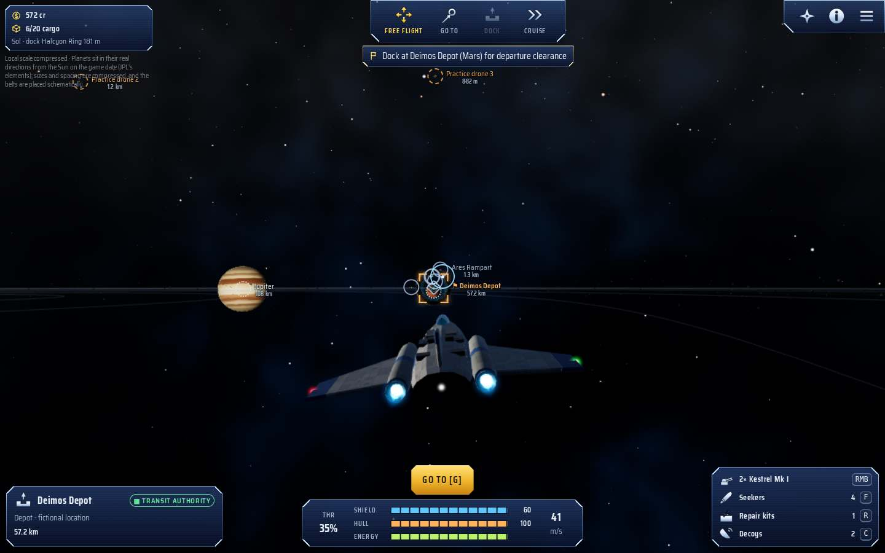

# Starman Reborn

A browser space trading and combat game set among **real nearby stars**: 207 systems out to 27
light-years, checked against the astronomical archives (252 stars, 99 planets and 9 debris belts),
from Sol, Alpha Centauri and Barnard's Star out to Vega and Fomalhaut. You fly a small courier with
the mouse, two thumbs or a gamepad. You trade medical supplies, fight or dodge a raider near Mars,
jump to Alpha Centauri, discover the real exoplanet Proxima Centauri b, and make the first delivery
to a fictional research outpost. After that the neighbourhood is open: 322 generated stations of
twelve kinds (ports, mines, refineries, farms, research stations, shipyards, free ports, raider
dens...), 23 goods with stock-based prices, world events reported in each station's news, traders
and patrols on the lanes, raider packs in lawless space, and contract boards in every station bar
(freight, courier parcels, supply runs, bounties, planet surveys, escorts and convoys that jump
with you, ace hunts, wreck recoveries, mining claims, rescues, war work, passengers and sightseers, some
urgent, some leading to follow-ups). 39 ships in six classes carry 146 pieces of equipment, among them a
long-range jump drive for the frontier beyond 17.5 light-years, which has a life of its own:
harvests at its farms, survey seasons at its research posts, and colony haulers stranded far from
any dock.

The law has teeth: witnesses, fines that lapse, cargo scans, contraband, bounty hunters and
pardons, and an outlaw path of piracy and smuggling that opens the raider dens' black markets.
The bars have people who sell true rumours for the price of a round, and a trade computer plans
routes from the prices you know. The world answers: a shortage you fill ends sooner, raids break,
and the stations' freight flies the lanes in named haulers on a timetable: a shortage draws relief
you can watch arrive (or race, or rob), a glut ships its surplus out (buy it up before it goes),
raids take haulers whose cargo never arrives, and a hauler bound through raided lanes will wait
for an escort. Where lawful space meets a raider den, a border war swings back
and forth, fought in sight in clashes off the beacons and battles for the stations on the line,
and your work tips it, until you win a front for good, for the law or for the Wake.
Seven hand-written story arcs give the sandbox a spine: three faction arcs; The Long Border, which
reads the choices made in the other three and settles a front for good, as a lawful pilot, an
outlaw or neither; First Harvest, out among the frontier's farms; The Long Winter, with Sol's
belt crews out in the Kuiper dark, where you may stand with their cutters against claim-jumpers;
and Last Light at Pyre, where the people of the invented star's observatory must get out before
it dies (Pyre waits for you once you take it on), perhaps in lifeboats you gather as it collapses.
However each of the faction arcs and the last three ends, it changes a station's market, and most
often its job board, for good. Pilot ratings, a codex of 366 real bodies, 32 milestones and a hint
of what to do next
give it goals, and a logbook keeps the career as it goes: each first arrival, ship, story, promotion,
milestone, race won and comet, asteroid, spacecraft or planet first scanned, dated on the game's calendar, with the
pilot's bests. Fights have seekers and decoy
flares, mines, damage to a ship's systems, loot, wingmen for hire who take six orders from a
paused card, grow with every fight and are picked up when shot down, and raider dens that defend
themselves and can be knocked out.
Pilots who would rather not fight can mine the real belts (the Solar System's main belt and Kuiper
Belt, and the debris discs astronomers have seen around nearby stars, each with its source): a
mining laser cuts ore, ice and volatiles from rocks, a prospecting scanner gets more from them,
refineries buy the load, mines and refineries post claim contracts, and raiders hunt miners. A
fleet of your own comes after the biggest ship: keep ships parked at stations, hire captains to
haul your routes (worked out from the game clock, for well under what flying them earns, with raids
and insurance), lease storage and buy a share of a station's trade. Your captains fly the same lanes
as everyone else's haulers: meet one on the way, guard it when raiders jump it, or watch it go.
And after the fleet, stations of your own (up to three, one to a system): charter a site in orbit of
a real planet or in a real belt, haul the materials there stage by stage, and your outpost opens,
trades and pays you by the hour. A belt outpost is a refinery that buys the ore, ice and gases you
mine for more than any market. Open outposts join the trade: haulers come and go from them on the
timetable, each paying a dock fee, and boards near by post freight and passages to them. Your captains can
supply an outpost being built, or mine its belt for a refinery while you watch them work. Raiders
come for an outpost now and then: build turrets there, hire guards, or be there to fight them off.
Your outposts have news like any station: shortages, gluts, booms and strikes move their prices and
income, draw relief haulers and work on the boards near by, and a toast tells you when one starts.
Each outpost has people of its own: a quartermaster from the day it opens and residents as it grows.
Now and then one asks you for something (goods, someone fetched from a station near by, a body of
its system scanned), and each ask done leaves the place changed for good: a workshop that patches
hulls at cost, a green bay that grows food, a clinic, a trading desk. Their spirit remembers what
you do, and nudges the income a little either way.
Sell one back for half of what went in, or abandon it.
Sign on a crew of your own (an engineer who patches the ship up in flight, a gunner, a navigator):
each has a heart that likes or hates what you do, a story, and a favour to ask, and they leave if
you treat them badly.
Fit a passenger cabin and the bars offer fares: passages between stations, and sightseers who pay
to be flown close to the real sky's planets, dwarf stars and belts, and say what the archives
record of them when they see them. A fight with passengers aboard costs you some of the fare.
And you are not the only pilot out there: six rivals with careers of their own trade the best
routes, take bounties off the boards (buy the claim back if you want the job) and race relief to
shortages. Meet them in the bars, the News and in flight; buy them a round, outbid them, or fight.
Each has a story with you: stand well with one and they ask for a loan, an escort or a rescue, and
end as an ally who flies on your wing; cross one and they set customs on you or send hired guns,
then call you out to a duel, one on one, each in your own ship.
And one day the sky changes: Betelgeuse, a real red supergiant some 500 light-years away, explodes
as a supernova that outshines everything in every sky, and later Antares quietly goes dark. Both
are fiction, labelled so in the game (neither star has died): the News and the research stations
tell it as it happens, and research stations pay pilots to observe it, down to measuring
Betelgeuse's distance by parallax from two systems far apart. Later, once you have reached the
frontier, Pyre dies: the one star the game invents, labelled so wherever it shows, a red supergiant
just beyond the edge of the map. Carry its observers out before it explodes, outrun its light
through the lanes, then fly to the black hole it leaves, read it from outside its tides, and keep
clear of them. Nearer home, ten real red dwarfs are flare stars, Proxima Centauri and Wolf 359 among
them: now and then one flares, its system's shields recharging slower and its scanners reaching
less far while it lasts, and research stations near by pay you to scan it before it settles (that
they flare is real; when is fiction). Twenty-two pairs of stars, Alpha Centauri A and B and Sirius A
and B among them, have their real orbits from the Sixth Catalog of Orbits of Visual Binary Stars:
each companion stands in its real direction, and its card says where the pair is on the game's
date. In Sol fourteen real comets, Halley and Encke among them, stand where JPL has them on the
game's date, growing a coma and tails that stream away from the Sun as they near it; the News tells
when one passes the Sun, and research stations near Sol pay you to image one. Fifteen named
asteroids fly there too, Ceres, Vesta, Bennu and Apophis among them, each on JPL's orbit and drawn in
its real shape; on 13 April 2029 Apophis passes Earth nearer than the Moon, as it really will, the
News tells of it and research stations pay you to track it. Jupiter's four large moons and Saturn's
Titan go round their planets where JPL Horizons has them on the game's date, each in the codex to
scan. Eleven spacecraft are out there too where Horizons has them, from Parker Solar Probe skimming
the Sun to Voyager 1 far beyond Neptune, each to fly to and scan, its card giving how long its light
takes to reach Earth and its mission's dated facts, quoted from JPL and NASA. And between the docks, the lanes call: a mayday that may be bait, a lifepod, a Wake
toll gate, a customs patrol open to a bribe, a stranded scientist, cargo adrift, a lost trader, a
wreck's beacon or an old hulk's, each a choice with consequences. Many lead somewhere to fly: a ship
in distress to reach, pods to tractor in, a wreck to salvage, an old derelict (invented, and labelled
so) to board by holding steady alongside; a scan of a planet may pick up a faint return too. Some
are bait, with raiders lying dark until you come close or a scan shows them. And a wreck's log may
hold a lead into a short trail across a few systems: a lost crew, a strongbox, an old hull's sister.
Stand well with a faction and build a record, and it gives you a rank: the Transit Authority's,
the Frontier Co-op's, or the Hollow Wake's for outlaws. A rank opens doors: commissions for their
own, discounts at their yards, docks that clear you in under fire, and your name in the News.
Race at the clubs in well-policed space: a Sprint round a real planet, moon or star, or a Run between
docks, against club racers and rival pilots who really fly the gates beside you, in a light or heavy
class of hull, for a purse, a course record and a Racing rating of your own.
Ships, equipment, the world, the economy, events, contracts and the law are generated from rule
files and checked by automated guardrails ([docs/PROCGEN.md](docs/PROCGEN.md)).

Star positions, distances, planets and debris belts come from the astronomical archives, checked
by a workflow on GitHub's runners (see [docs/ASTRONOMY_SOURCES.md](docs/ASTRONOMY_SOURCES.md)).
Planets an archive disputes are kept in this edition and say so. Stations, factions, jump travel,
trade lanes and all story text are original fiction and are labelled that way in the game, and so is
the one invented astronomical event, the deaths of Betelgeuse and Antares.

**Play now: <https://shotif.github.io/starman-reborn/>**



## Play

- **Online (HTTPS, works on phones):** <https://shotif.github.io/starman-reborn/>. Every push to
  `main` redeploys it.
- **Locally:** see *Run it* below.

The title appears straight away, even on a slow phone connection, with a bar where **Play** will
be that fills as the rest of the game arrives (about 610 KB compressed). After one visit the game
also works offline: the browser keeps its files.

A first playthrough takes about 10–20 minutes. Progress saves automatically in the browser
(IndexedDB) after docking, trading, rewards and jumps, and when the tab is hidden. Refresh at any
time and press **Continue**.

**Saves.** The autosave always follows the game you are playing. **Saves** (on the title screen,
in the pause menu and in the station menu) also keeps three save slots in the browser, and exports
any save as a `.json` file: a download on desktops and Android, the share sheet (for example *Save
to Files*) on iPhone and iPad. **Import file** reads a save file back, into a slot or straight into
play, on this or another device. Browsers can clear their storage, so export a file to keep a game
safe.

## Run it

Requirements: **Node.js 22.18 or newer** (the data scripts run TypeScript directly) and npm.

```bash
npm ci            # install the exact locked dependencies
npm run dev       # development server at http://localhost:5173
npm run build     # production static site in dist/ (relative asset paths)
npm run preview   # serve dist/ at http://localhost:4173
```

`npm run check` runs typecheck, data validation, unit tests, the production build and the
first-load budget (`npm run size`, which lists what a phone downloads and fails when the first
screen or the whole first load grows past its budget).

## Test on real phones and tablets (HTTPS)

Phones cannot open your desktop's `localhost`, and browser features such as audio unlock and
installability behave best over HTTPS. Pick one:

1. **GitHub Pages (recommended).** The game is live at <https://shotif.github.io/starman-reborn/>.
   Every push to `main` runs `.github/workflows/pages.yml`, which builds `dist/` and redeploys it;
   you can also run the workflow manually from the Actions tab. In a fork, first set *Settings →
   Pages → Build and deployment → Source* to **GitHub Actions**; the site then appears at
   `https://<user>.github.io/<repo>/`. GitHub Pages is free for public repositories; private
   repositories need a paid plan.
2. **Your local network with a self-signed certificate.** Run `npm run dev:https` (or
   `npm run build && npm run preview:https`). Vite prints a `https://192.168.x.x:5173` address.
   Open it on a phone on the same Wi‑Fi and accept the certificate warning.
3. **A tunnel.** Run `npm run preview`, then expose port 4173 with any HTTPS tunnel, for example
   `npx cloudflared tunnel --url http://localhost:4173`.

On the device, **Settings → Device report → Copy report** gives the phone, browser, screen, load
times, the last flight's frame rate and whether the game is kept for offline play, ready to paste
into the real-device checklist ([TEST_RECORD.md](docs/TEST_RECORD.md)). Nothing is sent anywhere.

## Controls

| Action | Mouse and keyboard | Touch | Gamepad |
| --- | --- | --- | --- |
| Steer | Move the mouse; the ship turns toward the cursor | Left thumb: drag anywhere in the lower left | Left stick |
| Aim and fire | Cursor is the reticle; hold the **right** mouse button | Right thumb: drag in the lower right; fires while held | Right stick moves the reticle; hold **RT** |
| Select target | Left-click a marker or object; **T** cycles, **H** nearest hostile | Target button (hold for nearest hostile) or tap a marker | **Y** cycles, **RB** nearest hostile |
| Throttle | **W / S**, mouse wheel | Slider on the left edge | D-pad **↑ / ↓** |
| Strafe | **A / D** | – | – |
| Boost | **Shift** | Boost button (hold) | **LT** (hold) |
| Cruise | **Space** | Cruise button | D-pad **→** |
| Dock, enter lane, interact, board a derelict (alongside and slow) | **E** | Green action button | **A** |
| Go to selected target / objective | **G** | Green action button ("Go to") | **A** ("Go to") or **R3** |
| Autopilot off (free flight) | **Free flight** on the command rail | Steer, or the action button ("Stop") | **B**, or steer |
| Missile, rocket or torpedo | **F** or middle mouse | Missile button | **X** |
| Repair kit | **R** | Repair button | D-pad **←** |
| Decoy flare against seekers | **C** | Decoy button | **LB** |
| Scan (a planet, star, belt, rock or wreck) | **X** | Action button ("Scan") | **A** ("Scan") |
| Mine the selected rock (mining laser, within 600 m) | **B** | Action button, amber ("Mine") | **A** ("Mine") |
| Engines off (drift) | **Z** | Drift button (landscape) | **L3** |
| Star map | **Tab** or **M** | Map button | **Back** (View) |
| Pause | **Esc** or **P** | Pause button | **Start** (Menu) |

Any gamepad the browser reports in the standard layout works in flight. Buttons are named as on an
Xbox pad; on a PlayStation pad **A** is ✕, **B** ○, **X** □, **Y** △, **LB / RB** are L1 / R1,
**LT / RT** L2 / R2, **Back** is Create and **Start** Options, and **L3 / R3** mean clicking the
sticks. Stations and menus use the mouse, keyboard or touch (Start closes the pause menu again and
Back the star map). The HUD's hints follow whichever device you used last, and on a phone or tablet
the touch controls hide while you use the pad.

On the star map:

| Action | Mouse and keyboard | Touch |
| --- | --- | --- |
| Turn the view | Drag; arrow keys | Drag with one finger |
| Zoom | Wheel, toward the cursor; **+ / −** or the zoom buttons | Pinch, toward your fingers; the zoom buttons |
| Zoom in on a spot | Double-click empty space | Double-tap empty space |
| Centre a star | Double-click it | Double-tap it |
| Move the view | Right-, middle- or Shift-drag | Two-finger drag |
| Find a system by name (or a star, planet, station or catalogue number in it) | **Find** or **/** | **Find** |
| The systems your missions send you to | **Missions** | **Missions** |
| The whole map again | **Home** or the reset button | The reset button |

The 2D view zooms the same way, and a drag (or the arrow keys) moves it.

Settings include alternate desktop steering (drag-to-steer, or keyboard steer with mouse aim),
invert pitch, a left-handed touch layout, aim assist (Off/Low/Medium, touch default Low), difficulty,
quality presets (Auto starts at Medium and steps down on a device that cannot keep up), text
size, reduced motion, camera shake, bloom and volume. A mouse or keyboard
attached to a tablet switches it to the desktop controls automatically.

## Project layout

```
src/app/       boot, game controller, renderer, loop, rules, settings, save (IndexedDB)
src/data/      curated systems, generated astronomy snapshot, coordinates, validation
src/galaxy/    neighbourhood star map (3D + 2D fallback), routing, info cards
src/flight/    ship dynamics, chase camera, autopilot, desktop, touch and gamepad input
src/combat/    guns, projectiles, missiles, lead/intercept, damage, raider AI
src/world/     local system scenes (hand-made and generated), flight session, traffic and raider
               packs (src/world/traffic), race courses and the racing pilot, border battles and
               the wing's orders, procedural art (src/world/art)
src/content/   rule-driven generators and guardrails (docs/PROCGEN.md): ships and equipment,
               the world (src/content/world: lanes, territory, stations) and the economy
               (src/content/economy: goods, market profiles), contract rules (src/content/contracts),
               event rules (src/content/events), the law (src/content/law), progress
               (src/content/progress), the story arcs (src/content/story), dens under fire
               (src/content/dens), combat depth (src/content/combat), people in the bars
               (src/content/people), the fleet (src/content/fleet), mining (src/content/mining),
               the border war (src/content/border), stellar death and flare stars
               (src/content/stellar), lane
               encounters (src/content/lanes), wrecks to fly to (src/content/wrecks), ranks
               (src/content/ranks), races (src/content/racing) and the wing (src/content/wing)
src/economy/   live markets, world events and the world's answers, trade, cargo, outfitter and
               shipyard, factions, jobs and generated contracts, the law, ratings, the codex,
               milestones, the story, people and rumours, the fleet, mining, the border war,
               the far stars' deaths and Pyre's (the invented star), flare stars, lane
               encounters, wrecks,
               ranks, racing, the wing, and border battles
src/audio/     procedural Web Audio music and sound effects
src/ui/        HUD, touch controls, station screens, encyclopedia, styles
scripts/       the sky snapshot (sky-fetch on GitHub's runners, sky-process, orbits-process, comets-process, asteroids-process, moons-process and spacecraft-process here), catalogue
               extraction (HYG, Open Exoplanet Catalogue, the far stars), dataset build and
               validation
tests/         unit tests (Vitest) and browser journeys (Playwright)
docs/          sources, design notes, test record, known gaps, screenshots
promo/         the 60-second trailer, made from the game itself: capture, soundtrack and edit
               (promo/README.md)
```

## Tests

```bash
npm test                       # unit tests (Vitest)
npx playwright install chromium  # once, to download the test browser
npm run test:e2e               # Playwright journeys on desktop and touch viewports
npm run screenshots            # layout screenshots + audits for the nine test sizes
npm run size                   # after a build: what the first load downloads, against its budget
```

The results and device coverage are recorded in [docs/TEST_RECORD.md](docs/TEST_RECORD.md). Open
issues are listed in [docs/KNOWN_GAPS.md](docs/KNOWN_GAPS.md).

## Astronomy data

The **Sky snapshot** workflow (`.github/workflows/sky-snapshot.yml`) runs `npm run data:fetch` on
GitHub's runners, which can reach SIMBAD, the ESA Gaia archive, VizieR, the NASA Exoplanet Archive
and the Extrasolar Planets Encyclopaedia, and pushes the raw answers to the `sky-snapshot` branch.
`npm run data:process` turns them into `data/snapshot/` with a report, `npm run data:build`
regenerates the bundled dataset, and `npm run data:validate` checks it. It runs by hand from the
Actions tab and once a month. The first 27 catalogue systems came from the HYG star database v4.0
(CC BY-SA 4.0) and the Open Exoplanet Catalogue (MIT) through `scripts/extract-catalogs.ts`, and
the two far stars beyond the map (Betelgeuse and Antares) from HYG through
`scripts/extract-far-stars.ts`, until a snapshot checks them; the derived data keep those licences ([data/provisional/NOTICE.md](data/provisional/NOTICE.md)). The
game never calls these services at runtime. Details, exceptions and uncertainty are in
[docs/ASTRONOMY_SOURCES.md](docs/ASTRONOMY_SOURCES.md).

## Credits and rights

All code, art (procedural), music and sound effects (synthesized at runtime), UI and writing are
original to this project. The design is inspired by classic mouse-flight space-trading games; see
[docs/DESIGN.md](docs/DESIGN.md) for the design notes.
